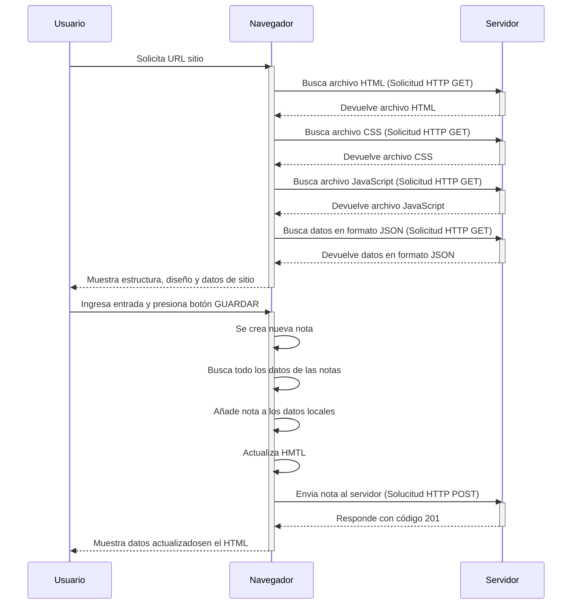

```mermaid
sequenceDiagram
    participant Usuario
    participant Navegador
    participant Servidor
    
    Usuario->>Navegador: Solicita URL sitio
		activate Navegador
		Navegador->>Servidor: Busca archivo HTML (Solicitud HTTP GET) 
		activate Servidor
		Servidor-->>Navegador: Devuelve archivo HTML
		deactivate Servidor
		Navegador->>Servidor: Busca archivo CSS (Solicitud HTTP GET)
		activate Servidor
		Servidor-->>Navegador: Devuelve archivo CSS
		deactivate Servidor
		Navegador->>Servidor: Busca archivo JavaScript (Solicitud HTTP GET)
		activate Servidor
		Servidor-->>Navegador: Devuelve archivo JavaScript
		deactivate Servidor
		Navegador->>Servidor: Busca datos en formato JSON (Solicitud HTTP GET)
		activate Servidor
		Servidor-->>Navegador: Devuelve datos en formato JSON
		deactivate Servidor
		Navegador-->>Usuario: Muestra estructura, diseño y datos de sitio
		deactivate Navegador
		Usuario->>Navegador: Ingresa entrada y presiona botón GUARDAR
		activate Navegador
	  Navegador->>Navegador: Se crea nueva nota
	  Navegador->>Navegador: Busca todo los datos de las notas
	  Navegador->>Navegador: Añade nota a los datos locales
	  Navegador->>Navegador: Actualiza HMTL
	  Navegador->>Servidor: Envia nota al servidor (Solucitud HTTP POST)
		activate Servidor
	  Servidor-->>Navegador: Responde con código 201
		deactivate Servidor
		Navegador-->>Usuario: Muestra datos actualizadosen el HTML
		deactivate Navegador

```
