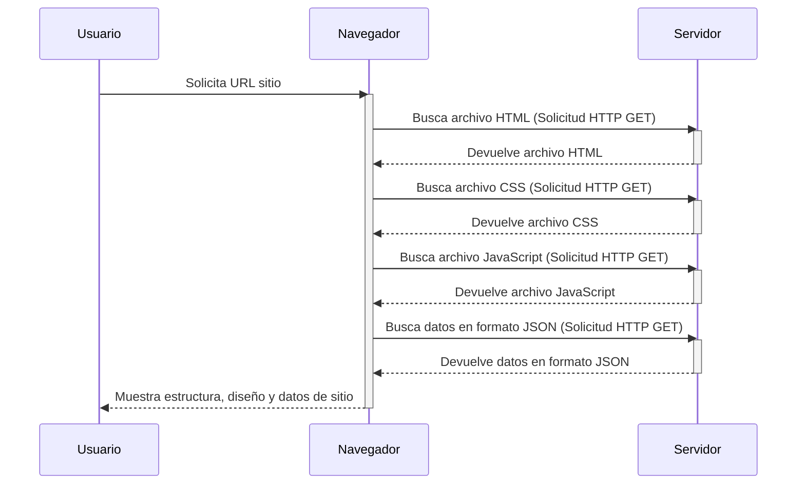

# Diagrama Nueva Nota - Single Page App

```mermaid
%%El diagrama sería bastante similar a la otra página
%%ya que todos los recursos se tendrían que cargar
sequenceDiagram
    participant Usuario
    participant Navegador
    participant Servidor
    
    Usuario->>Navegador: Solicita URL sitio
		activate Navegador
		Navegador->>Servidor: Busca archivo HTML (Solicitud HTTP GET) 
		activate Servidor
		Servidor-->>Navegador: Devuelve archivo HTML
		deactivate Servidor
		Navegador->>Servidor: Busca archivo CSS (Solicitud HTTP GET)
		activate Servidor
		Servidor-->>Navegador: Devuelve archivo CSS
		deactivate Servidor
		Navegador->>Servidor: Busca archivo JavaScript (Solicitud HTTP GET)
		activate Servidor
		Servidor-->>Navegador: Devuelve archivo JavaScript
		deactivate Servidor
		Navegador->>Servidor: Busca datos en formato JSON (Solicitud HTTP GET)
		activate Servidor
		Servidor-->>Navegador: Devuelve datos en formato JSON
		deactivate Servidor
		Navegador-->>Usuario: Muestra estructura, diseño y datos de sitio
		deactivate Navegador
```
